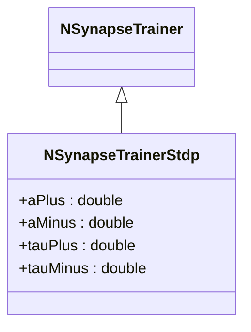
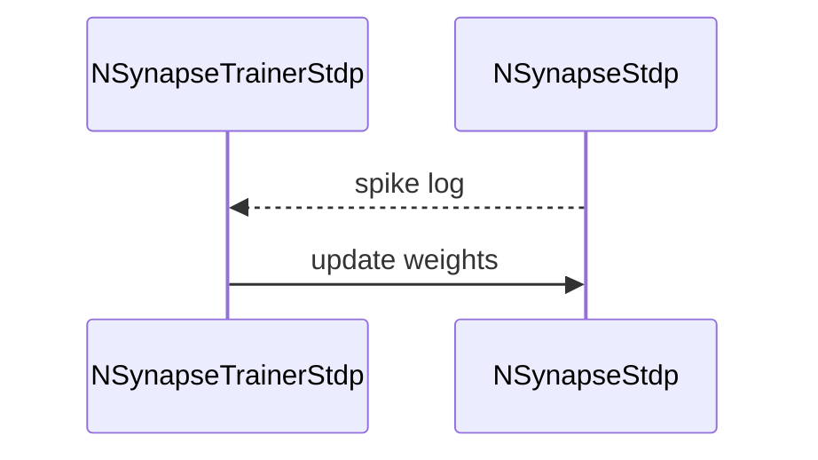

## NSynapseTrainerStdp — тренер STDP (Nmsdk-PulseLib)

**Класс**: `NSynapseTrainerStdp` (и варианты TD/WD/Triplet/Probabilistic и др.) — обучает веса синапсов по правилам STDP.  
**Регистрация**: `NPulseLibrary.cpp` → `UploadClass("NSynapseTrainerStdp", ...)` и специализированные варианты.  
**Storage-инстансы**: `ClassName = "NSynapseTrainerStdp"` с параметрами коэффициентов обучения.

### Жизненный цикл
- **ADefault**: коэффициенты STDP.
- **ABuild**: связывание с целевыми синапсами.
- **ACalculate**: шаг обучения по журналу спайков pre/post.

### Входы/выходы
- Вход: события спайков pre/post (может брать из связанных синапсов).
- Выход: обновлённые веса в целевых синапсах.

Пояснение: диаграмма последовательности показывает типовой сценарий взаимодействия и порядок вызовов.

Пояснение: блок-схема показывает поток данных/сигналов (входы → компонент → выходы).

---

## NSynapseTrainerStdp — STDP trainer

Processes spike timings and updates target synapse weights according to STDP learning rule.
