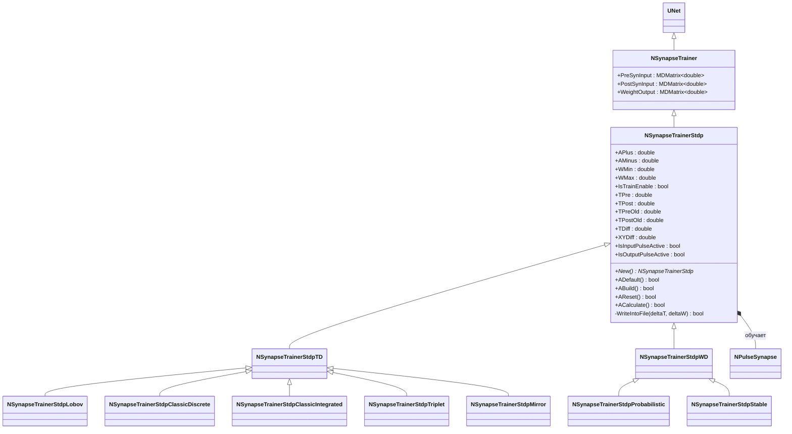
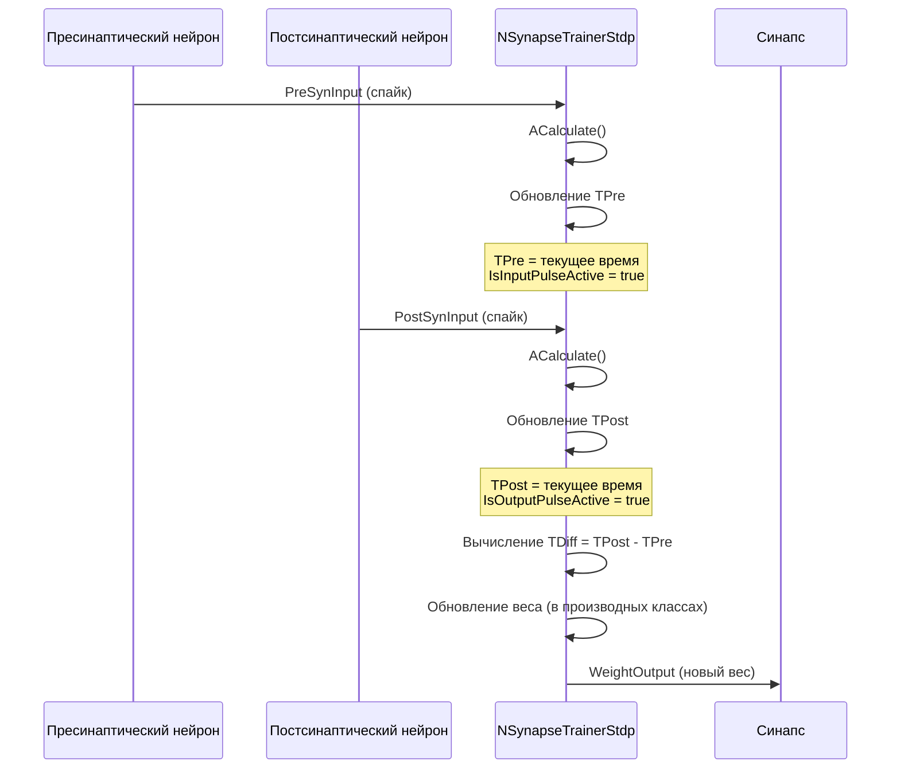
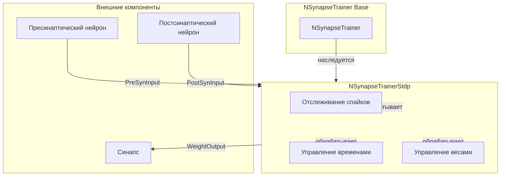
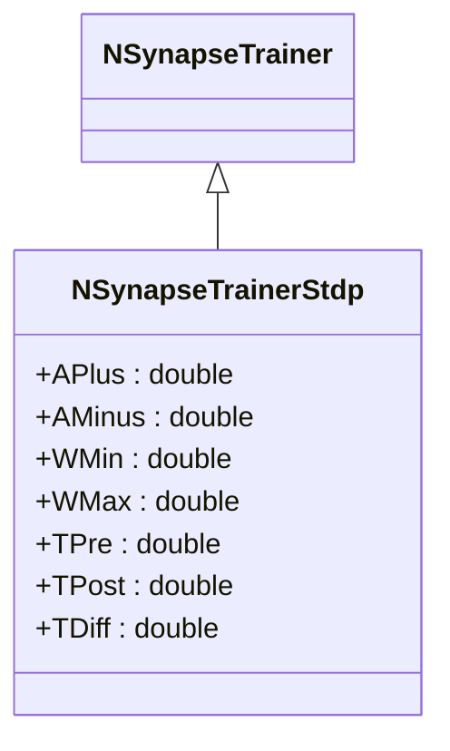
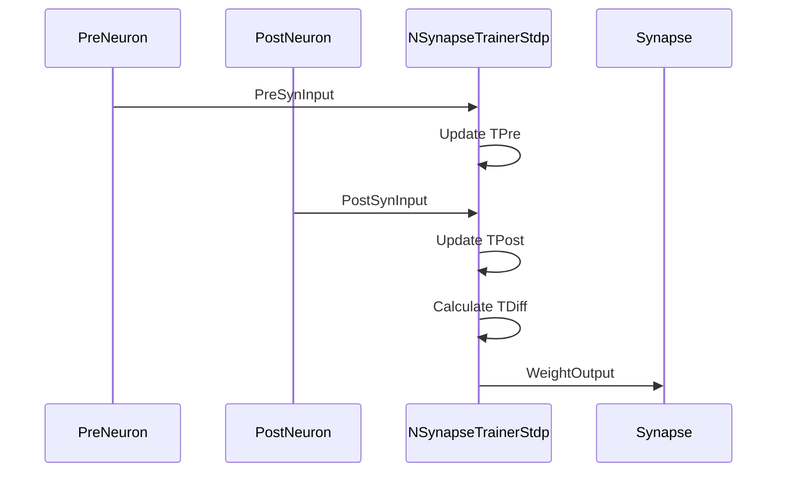
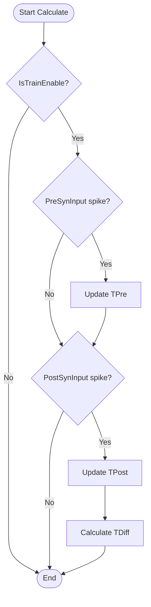
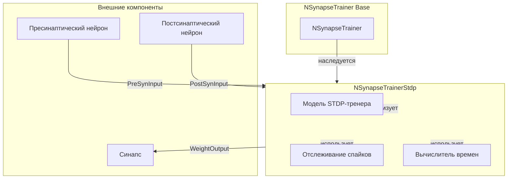

# NSynapseTrainerStdp — базовый тренер STDP

## RU

### Назначение

**Класс**: `NSynapseTrainerStdp` — базовый класс тренера для обучения синапсов по правилу STDP (Spike-Timing Dependent Plasticity).  
**Регистрация**: `NPulseLibrary.cpp` → `UploadClass("NSynapseTrainerStdp", ...)`.  
**Storage-инстансы**: `ClassName = "NSynapseTrainerStdp"` в `Bin/Configs/*/Model_*.xml`.

`NSynapseTrainerStdp` реализует базовую функциональность для обучения синапсов по правилу STDP. Отслеживает времена пресинаптических и постсинаптических спайков (`TPre`, `TPost`), вычисляет разность времен (`TDiff`), и обновляет веса синапсов на основе этой разности. Базовый класс предоставляет общую инфраструктуру для отслеживания спайков, но не реализует конкретное правило изменения весов — это делается в производных классах.

**Использование:** Базовый класс для всех вариантов STDP-тренеров, отслеживание времен спайков, управление обучением синапсов

### UML-диаграмма классов



**Иерархия наследования:**
- `UNet` — базовая сеть Rdk Framework
- `NSynapseTrainer` — базовый тренер синапсов
- `NSynapseTrainerStdp` — базовый STDP-тренер

**Связи:**
- Обучает синапсы (`NPulseSynapse` и его производные)
- Получает входы от пресинаптических и постсинаптических нейронов

### UML-диаграмма последовательности



**Жизненный цикл:**
1. **Инициализация**: Установка параметров по умолчанию (`APlus`, `AMinus`, `WMin`, `WMax`)
2. **Сброс**: Инициализация времен спайков, случайная инициализация веса
3. **Расчет**: Отслеживание спайков, обновление времен, вычисление разности времен

### UML-диаграмма состояний

```mermaid
stateDiagram-v2
    [*] --> Uninitialized: New()
    Uninitialized --> Defaulted: Default()
    Defaulted --> Built: Build()
    Built --> Ready: Ready = true
    Ready --> Resetting: Reset()
    Resetting --> InitTimes: Инициализация TPre, TPost
    InitTimes --> RandomWeight: Случайная инициализация веса
    RandomWeight --> Ready: Состояния сброшены
    Ready --> Calculating: Calculate()
    Calculating --> CheckTrainEnable{IsTrainEnable?}
    CheckTrainEnable -->|Нет| Ready: Обучение отключено
    CheckTrainEnable -->|Да| CheckPreInput{PreSynInput > 0?}
    CheckPreInput -->|Да| UpdateTPre: Обновление TPre
    CheckPreInput -->|Нет| CheckPostInput{PostSynInput > 0?}
    UpdateTPre --> SetPreActive: IsInputPulseActive = true
    SetPreActive --> CheckPostInput
    CheckPostInput -->|Да| UpdateTPost: Обновление TPost
    CheckPostInput -->|Нет| Ready: Шаг завершен
    UpdateTPost --> SetPostActive: IsOutputPulseActive = true
    SetPostActive --> CalcTDiff: TDiff = TPost - TPre
    CalcTDiff --> Ready: Шаг завершен
```

### UML-диаграмма активности

```mermaid
flowchart TD
    Start([Start Calculate]) --> CheckTrainEnable{IsTrainEnable?}
    CheckTrainEnable -->|Нет| End([End])
    CheckTrainEnable -->|Да| CheckPreConnected{PreSynInput.IsConnected()?}
    CheckPreConnected -->|Нет| SetWeight1[WeightOutput = 1]
    CheckPreConnected -->|Да| CheckPreCols{PreSynInput.GetCols() > 0?}
    CheckPreCols -->|Нет| SetWeight1
    CheckPreCols -->|Да| CheckPostConnected{PostSynInput.IsConnected()?}
    CheckPostConnected -->|Нет| SetWeight1
    CheckPostConnected -->|Да| CheckPostCols{PostSynInput.GetCols() > 0?}
    CheckPostCols -->|Нет| SetWeight1
    CheckPostCols -->|Да| ResetFlags[IsInputPulseActive = false<br/>IsOutputPulseActive = false]
    SetWeight1 --> End
    ResetFlags --> CheckPreSpike{PreSynInput > 0 и<br/>время > TPre + 1/TimeStep?}
    CheckPreSpike -->|Да| UpdateTPre[TPreOld = TPre<br/>TPre = текущее время<br/>IsInputPulseActive = true]
    CheckPreSpike -->|Нет| CheckPostSpike{PostSynInput > 0 и<br/>время > TPost + 1/TimeStep?}
    UpdateTPre --> CheckPostSpike
    CheckPostSpike -->|Да| UpdateTPost[TPostOld = TPost<br/>TPost = текущее время<br/>IsOutputPulseActive = true]
    CheckPostSpike -->|Нет| End
    UpdateTPost --> End
    
    Note1[Базовый класс только отслеживает спайки.<br/>Изменение весов реализуется в производных классах.]
    Note1 -.-> End
```

**Алгоритм расчета:**
Базовый класс `NSynapseTrainerStdp` только отслеживает времена спайков и устанавливает флаги активности. Конкретное правило изменения весов реализуется в производных классах (`NSynapseTrainerStdpTD`, `NSynapseTrainerStdpWD` и их вариантах).

### UML-диаграмма компонентов



### Свойства

#### Параметры (ptPubParameter)

- **`APlus`** (double) — коэффициент усиления для LTP (Long-Term Potentiation), когда постсинаптический спайк следует за пресинаптическим (`TPost > TPre`). Значение по умолчанию: зависит от производного класса

- **`AMinus`** (double) — коэффициент ослабления для LTD (Long-Term Depression), когда пресинаптический спайк следует за постсинаптическим (`TPre > TPost`). Значение по умолчанию: зависит от производного класса

- **`WMin`** (double) — минимальное значение веса синапса. Значение по умолчанию: -2.0

- **`WMax`** (double) — максимальное значение веса синапса. Значение по умолчанию: 2.0

#### Состояния (ptPubState)

- **`IsTrainEnable`** (bool) — флаг включения/выключения обучения. Если `false`, обучение не выполняется. Значение по умолчанию: `true`

- **`TPre`** (double) — время последнего пресинаптического спайка. Начальное значение: 0.0

- **`TPost`** (double) — время последнего постсинаптического спайка. Начальное значение: 0.0

- **`TPreOld`** (double) — время предыдущего пресинаптического спайка. Начальное значение: 0.0

- **`TPostOld`** (double) — время предыдущего постсинаптического спайка. Начальное значение: 0.0

- **`TDiff`** (double) — разность времен спайков (`TPost - TPre`). Положительное значение означает, что постсинаптический спайк последовал за пресинаптическим (LTP), отрицательное — наоборот (LTD). Начальное значение: 0.0

- **`XYDiff`** (double) — промежуточная переменная для вычисления изменения веса (используется в производных классах). Начальное значение: 0.0

- **`IsInputPulseActive`** (bool) — флаг активности пресинаптического спайка на текущем шаге. Устанавливается в `true`, когда обнаружен новый пресинаптический спайк

- **`IsOutputPulseActive`** (bool) — флаг активности постсинаптического спайка на текущем шаге. Устанавливается в `true`, когда обнаружен новый постсинаптический спайк

**Наследуемые свойства от NSynapseTrainer:**
- `PreSynInput` (MDMatrix<double>) — входной сигнал от пресинаптического нейрона
- `PostSynInput` (MDMatrix<double>) — входной сигнал от постсинаптического нейрона
- `WeightOutput` (MDMatrix<double>) — выходной вес синапса (обновляется тренером)

### Методы

#### Публичные методы

- **`New()`** → `NSynapseTrainerStdp*` — создает новый экземпляр класса.

#### Защищенные методы жизненного цикла

- **`ADefault()`** → `bool` — инициализирует параметры по умолчанию. Устанавливает `WeightOutput = 1.0`, `IsTrainEnable = true`, `WMin = -2.0`, `WMax = 2.0`, инициализирует времена спайков в 0.0.

- **`ABuild()`** → `bool` — строит структуру тренера. В базовом классе не выполняет дополнительных действий.

- **`AReset()`** → `bool` — сбрасывает состояния тренера. Инициализирует времена спайков в 0.0, устанавливает случайное начальное значение веса в диапазоне `[WMin, WMax]`.

- **`ACalculate()`** → `bool` — выполняет расчет тренера на одном шаге. Отслеживает пресинаптические и постсинаптические спайки, обновляет времена `TPre` и `TPost`, вычисляет `TDiff`. Если обучение отключено (`IsTrainEnable = false`) или входы не подключены, устанавливает `WeightOutput = 1.0`.

#### Защищенные методы

- **`WriteIntoFile(double deltaT, double deltaW)`** → `bool` — записывает изменение веса и разность времен в файл (для отладки). В текущей реализации записывает в жестко заданные пути.

### Примеры использования

#### Пример 1: Создание тренера в коде C++

```cpp
// Создание базового STDP-тренера
auto trainer = storage->CreateComponent<NSynapseTrainerStdp>();
trainer->SetName("STDPTrainer");

// Инициализация
trainer->Default();

// Настройка параметров
trainer->APlus = 0.01;
trainer->AMinus = 0.01;
trainer->WMin = 0.0;
trainer->WMax = 1.0;
trainer->IsTrainEnable = true;

// Сборка
trainer->Build();
```

#### Пример 2: Конфигурация XML

```xml
<Trainer1 Class="NSynapseTrainerStdp">
    <Parameters>
        <APlus>0.01</APlus>
        <AMinus>0.01</AMinus>
        <WMin>0.0</WMin>
        <WMax>1.0</WMax>
        <IsTrainEnable>true</IsTrainEnable>
    </Parameters>
</Trainer1>
```

### Использование в конфигурациях

`NSynapseTrainerStdp` используется как базовый класс для всех вариантов STDP-тренеров:

- Базовый класс для всех STDP-тренеров
- Отслеживание времен спайков
- Управление обучением синапсов

**Особенности:**
- Базовый класс не реализует конкретное правило изменения весов
- Конкретные правила реализуются в производных классах (`NSynapseTrainerStdpTD`, `NSynapseTrainerStdpWD` и их вариантах)
- Предоставляет общую инфраструктуру для отслеживания спайков и управления весами

**Производные классы:**
- `NSynapseTrainerStdpTD` — STDP, зависящий от времени напрямую
- `NSynapseTrainerStdpWD` — STDP, зависящий от веса напрямую
- `NSynapseTrainerStdpLobov` — STDP по Лобову
- `NSynapseTrainerStdpClassicDiscrete` — классический STDP (дискретный)
- `NSynapseTrainerStdpClassicIntegrated` — классический STDP (интегрированный)
- `NSynapseTrainerStdpTriplet` — STDP Triplet
- `NSynapseTrainerStdpMirror` — STDP Mirror
- `NSynapseTrainerStdpProbabilistic` — вероятностный STDP
- `NSynapseTrainerStdpStable` — стабильный STDP

### См. также

- [`NSynapseTrainer`](NSynapseTrainer.md) — базовый тренер синапсов
- [`NSynapseTrainerStdpTD`](NSynapseTrainerStdpTD.md) — STDP, зависящий от времени
- [`NSynapseTrainerStdpWD`](NSynapseTrainerStdpWD.md) — STDP, зависящий от веса
- [`NPulseSynapseStdp`](NPulseSynapseStdp.md) — импульсный синапс с STDP
- [`NSynapseStdp`](NSynapseStdp.md) — синапс STDP
- [Architecture.md](../Architecture.md) — архитектура библиотеки
- [Scientific-Background.md](../Scientific-Background.md) — научный фон (STDP, синаптическая пластичность)

---

## EN

### Purpose

**Class**: `NSynapseTrainerStdp` — base class trainer for synapse learning according to STDP (Spike-Timing Dependent Plasticity) rule.  
**Registration**: `NPulseLibrary.cpp` → `UploadClass("NSynapseTrainerStdp", ...)`.  
**Instances**: `ClassName = "NSynapseTrainerStdp"` in `Bin/Configs/*/Model_*.xml`.

`NSynapseTrainerStdp` implements basic functionality for synapse learning according to STDP rule. Tracks presynaptic and postsynaptic spike times (`TPre`, `TPost`), calculates time difference (`TDiff`), and updates synapse weights based on this difference. Base class provides common infrastructure for spike tracking but does not implement specific weight change rule — this is done in derived classes.

**Usage:** Base class for all STDP trainer variants, spike time tracking, synapse learning management

### UML Class Diagram



### UML Sequence Diagram



### UML State Diagram

```mermaid
stateDiagram-v2
    [*] --> Uninitialized: New()
    Uninitialized --> Defaulted: Default()
    Defaulted --> Built: Build()
    Built --> Ready: Ready = true
    Ready --> Calculating: Calculate()
    Calculating --> CheckTrainEnable{IsTrainEnable?}
    CheckTrainEnable -->|No| Ready: Training disabled
    CheckTrainEnable -->|Yes| CheckPreInput{PreSynInput > 0?}
    CheckPreInput -->|Yes| UpdateTPre: Update TPre
    CheckPreInput -->|No| CheckPostInput{PostSynInput > 0?}
    UpdateTPre --> CheckPostInput
    CheckPostInput -->|Yes| UpdateTPost: Update TPost
    CheckPostInput -->|No| Ready: Step completed
    UpdateTPost --> CalcTDiff: Calculate TDiff
    CalcTDiff --> Ready: Step completed
    Ready --> Resetting: Reset()
    Resetting --> Ready
```

### UML Activity Diagram



### UML Component Diagram



### See Also

- [`NSynapseTrainer`](NSynapseTrainer.md) — base synapse trainer
- [`NSynapseTrainerStdpTD`](NSynapseTrainerStdpTD.md) — time-dependent STDP
- [`NSynapseTrainerStdpWD`](NSynapseTrainerStdpWD.md) — weight-dependent STDP
- [`NPulseSynapseStdp`](NPulseSynapseStdp.md) — spiking synapse with STDP
- [`NSynapseStdp`](NSynapseStdp.md) — STDP synapse
- [Architecture.md](../Architecture.md) — library architecture
