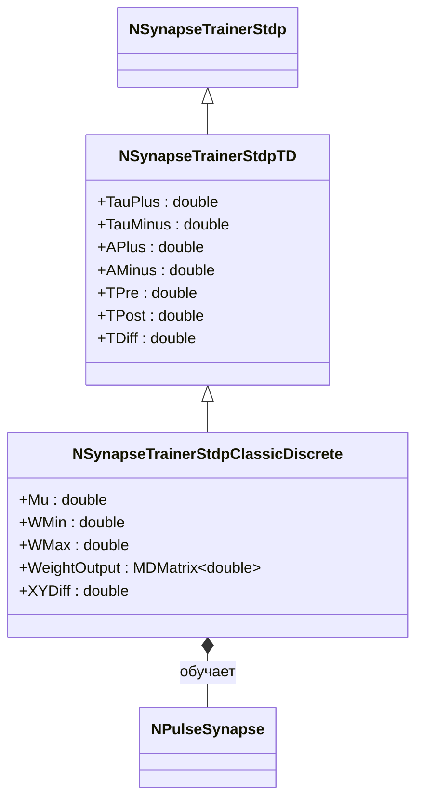
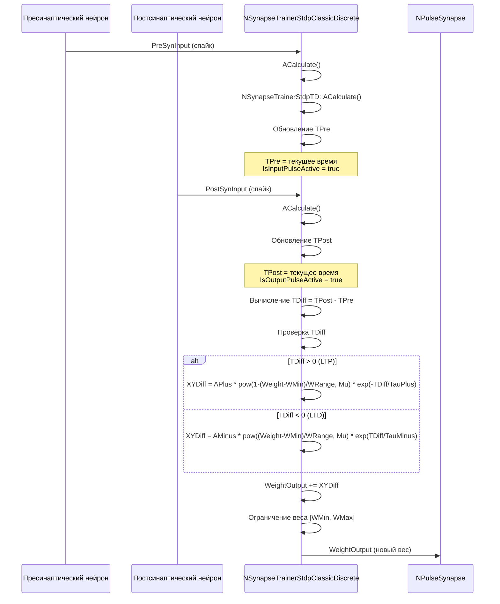
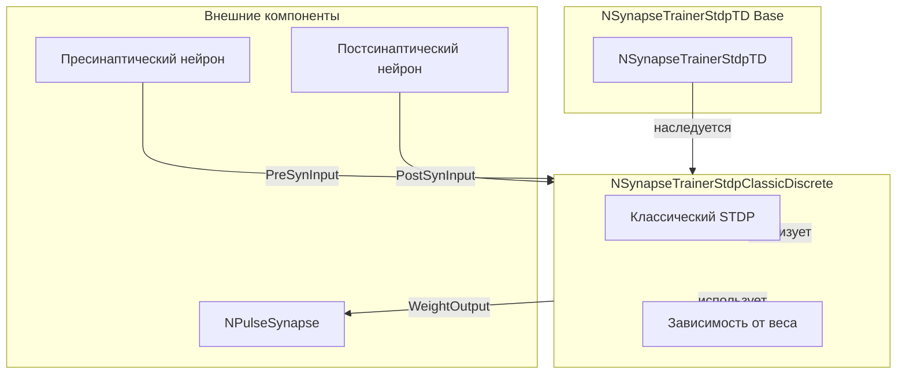
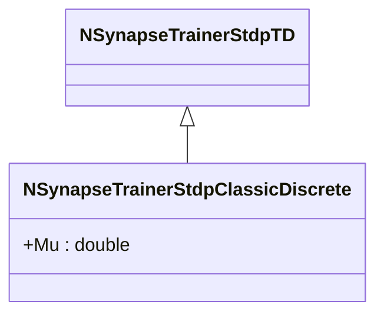
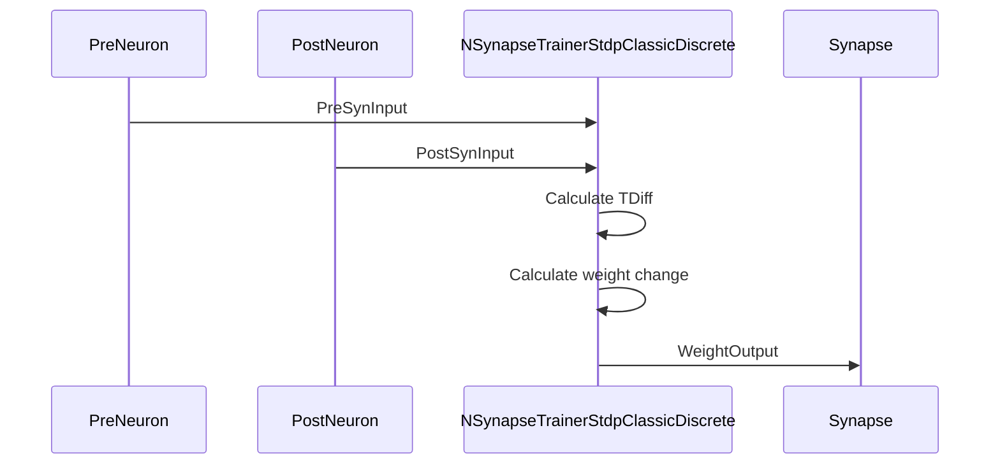
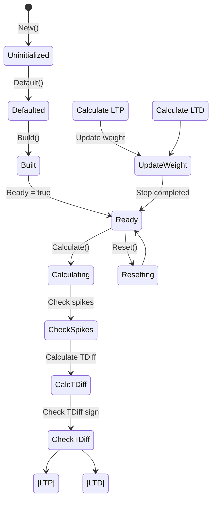
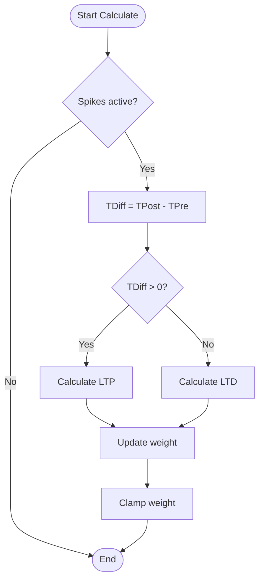
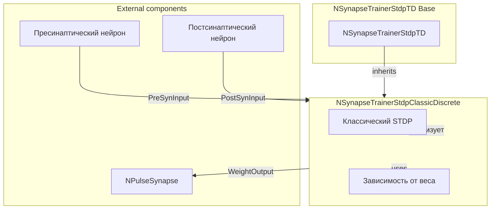

# NSynapseTrainerStdpClassicDiscrete — классический STDP (дискретный)

## RU

### Назначение

**Класс**: `NSynapseTrainerStdpClassicDiscrete` — классический STDP с дискретной реализацией.
**Аббревиатура**: `STDP` — **S**pike-**T**iming **D**ependent **P**lasticity (пластичность, зависящая от времени спайков).
**Регистрация**: `NPulseLibrary.cpp` → `UploadClass("NSynapseTrainerStdpClassicDiscrete", ...)`.
**Storage-инстансы**: `ClassName = "NSynapseTrainerStdpClassicDiscrete"` в `Bin/Configs/*/Model_*.xml`.

`NSynapseTrainerStdpClassicDiscrete` реализует классический STDP с дискретной реализацией. Наследуется от `NSynapseTrainerStdpTD` и использует параметр `Mu` для управления зависимостью изменения веса от текущего веса. Формула изменения веса зависит от разности времен спайков (`TDiff`) и текущего веса. Соответствует дискретному изменению веса по ВКР Зарубина: LTP/LTD задаются разностью времён спайков Δt, зависимость от веса — через w/w_max (формула (2.8) в [B]).

### STDP — formula stub

Кратко по [Literature-References.md](../Literature-References.md) ([B]):

- \(\Delta t = t_\mathrm{post} - t_\mathrm{pre}\) (в коде — `TDiff`).
- LTP (\(\Delta t > 0\)): \(\Delta w \propto A_+\,(1 - \tilde{w})^{\mu}\,e^{-\Delta t/\tau_+}\)
- LTD (\(\Delta t < 0\)): \(\Delta w \propto A_-\,\tilde{w}^{\mu}\,e^{\Delta t/\tau_-}\)
- \(\tilde{w} = (w - w_\min)/(w_\max - w_\min)\); в коде: `APlus`/`AMinus`, `TauPlus`/`TauMinus`, `Mu`.

**Использование:** Классический STDP с дискретной реализацией, зависимость от веса

### UML-диаграмма классов



**Иерархия наследования:**
- `NSynapseTrainerStdp` — базовый STDP-тренер
- `NSynapseTrainerStdpTD` — STDP, зависящий от времени
- `NSynapseTrainerStdpClassicDiscrete` — классический STDP (дискретный)

### UML-диаграмма последовательности



**Жизненный цикл:**
1. **Инициализация**: Установка параметров по умолчанию (`Mu=10.0`, `APlus=5.0`, `AMinus=-5.0`)
2. **Сброс**: Инициализация времен спайков, случайная инициализация веса
3. **Расчет**: Отслеживание спайков, вычисление изменения веса с зависимостью от текущего веса

### UML-диаграмма состояний

```mermaid
stateDiagram-v2
    [*] --> Uninitialized: New()
    Uninitialized --> Defaulted: Default()
    Defaulted --> Built: Build()
    Built --> Ready: Ready = true
    Ready --> Calculating: Calculate()
    Calculating --> CheckTrainEnable{IsTrainEnable?}
    CheckTrainEnable -->|Нет| Ready: Обучение отключено
    CheckTrainEnable -->|Да| CheckSpikes{Спайки активны?}
    CheckSpikes -->|Нет| Ready: Шаг завершен
    CheckSpikes -->|Да| CalcTDiff: TDiff = TPost - TPre
    CalcTDiff --> CheckTDiff{TDiff > 0?}
    CheckTDiff -->|Да| CalcLTP: XYDiff = APlus * pow(...) * exp(-TDiff/TauPlus)
    CheckTDiff -->|Нет| CalcLTD: XYDiff = AMinus * pow(...) * exp(TDiff/TauMinus)
    CalcLTP --> UpdateWeight: WeightOutput += XYDiff
    CalcLTD --> UpdateWeight
    UpdateWeight --> ClampWeight: Ограничение [WMin, WMax]
    ClampWeight --> Ready: Шаг завершен
    Ready --> Resetting: Reset()
    Resetting --> Ready: Состояния сброшены
```

**Состояния:**
- **Uninitialized** — создан, но не инициализирован
- **Defaulted** — параметры установлены по умолчанию
- **Built** — структура тренера построена
- **Ready** — готов к выполнению расчетов
- **Calculating** — выполняется расчет тренера
- **CheckTrainEnable** — проверка включения обучения
- **CheckSpikes** — проверка активности спайков
- **CalcTDiff** — вычисление разности времен спайков
- **CheckTDiff** — проверка знака TDiff
- **CalcLTP** — вычисление LTP (Long-Term Potentiation)
- **CalcLTD** — вычисление LTD (Long-Term Depression)
- **UpdateWeight** — обновление веса синапса
- **ClampWeight** — ограничение веса в диапазоне [WMin, WMax]
- **Resetting** — выполняется сброс состояний

### UML-диаграмма активности

```mermaid
flowchart TD
    Start([Start Calculate]) --> CallBase[NSynapseTrainerStdpTD::ACalculate]
    CallBase --> CheckTrainEnable{IsTrainEnable?}
    CheckTrainEnable -->|Нет| End([End])
    CheckTrainEnable -->|Да| CheckSpikes["IsInputPulseActive или<br/>IsOutputPulseActive?"]
    CheckSpikes -->|Нет| End
    CheckSpikes -->|Да| CheckTimes{TPre != 0 и TPost != 0?}
    CheckTimes -->|Нет| End
    CheckTimes -->|Да| CalcTDiff[TDiff = TPost - TPre]
    CalcTDiff --> CheckTDiff{TDiff > 0?}
    CheckTDiff -->|Да| CalcLTP[XYDiff = APlus * pow(1-(Weight-WMin)/WRange, Mu) * exp(-TDiff/TauPlus)]
    CheckTDiff -->|Нет| CheckTDiffNeg{TDiff < 0?}
    CheckTDiffNeg -->|Да| CalcLTD[XYDiff = AMinus * pow((Weight-WMin)/WRange, Mu) * exp(TDiff/TauMinus)]
    CheckTDiffNeg -->|Нет| End
    CalcLTP --> UpdateWeight[WeightOutput += XYDiff]
    CalcLTD --> UpdateWeight
    UpdateWeight --> ClampMin{WeightOutput < WMin?}
    ClampMin -->|Да| SetMin[WeightOutput = WMin]
    ClampMin -->|Нет| ClampMax{WeightOutput > WMax?}
    ClampMax -->|Да| SetMax[WeightOutput = WMax]
    ClampMax -->|Нет| WriteFile[Запись в файл]
    SetMin --> WriteFile
    SetMax --> WriteFile
    WriteFile --> End
```

**Алгоритм расчета:**
1. Вызов базового расчета (`NSynapseTrainerStdpTD::ACalculate()`)
2. Проверка активности спайков и времен
3. Вычисление разности времен: `TDiff = TPost - TPre`
4. Вычисление изменения веса:
   - Если `TDiff > 0` (LTP): `XYDiff = APlus * pow(1-(Weight-WMin)/WRange, Mu) * exp(-TDiff/TauPlus)`
   - Если `TDiff < 0` (LTD): `XYDiff = AMinus * pow((Weight-WMin)/WRange, Mu) * exp(TDiff/TauMinus)`
5. Обновление веса: `WeightOutput += XYDiff`
6. Ограничение веса в диапазоне `[WMin, WMax]`
7. Запись изменения веса в файл (если изменился)

### UML-диаграмма компонентов



**Зависимости:**
- **Базовый класс**: `NSynapseTrainerStdpTD`
- **Внутренние компоненты**: классический STDP (дискретная реализация), зависимость от веса (параметр `Mu`)
- **Внешние компоненты**: пресинаптический нейрон (источник `PreSynInput`), постсинаптический нейрон (источник `PostSynInput`), синапс (получатель `WeightOutput`)

### Свойства

#### Параметры (ptPubParameter)

- **`Mu`** (double) — параметр зависимости изменения веса от текущего веса. Используется в формуле: `pow((Weight-WMin)/WRange, Mu)` для LTD и `pow(1-(Weight-WMin)/WRange, Mu)` для LTP. Значение по умолчанию: 10.0

**Наследуемые параметры:**
- `APlus = 5.0`, `AMinus = -5.0`, `TauPlus = 0.01`, `TauMinus = 0.02`

### Методы

- **`ACalculate()`** → `bool` — выполняет расчет классического STDP:
  - Если `TDiff > 0` (LTP): `XYDiff = APlus * pow(1-(Weight-WMin)/WRange, Mu) * exp(-TDiff/TauPlus)`
  - Если `TDiff < 0` (LTD): `XYDiff = AMinus * pow((Weight-WMin)/WRange, Mu) * exp(TDiff/TauMinus)`
  - Обновляет вес: `WeightOutput += XYDiff`

### Использование в конфигурациях

`NSynapseTrainerStdpClassicDiscrete` используется в экспериментах с классическим STDP:

- **STDP-обучение**: `Bin/Configs/!OldConfigs/STDP-Simple-01/` (классический STDP с дискретной реализацией)

**Типичные значения параметров:**
- **Mu**: 10.0 (параметр зависимости от веса)
- **APlus**: 5.0 (амплитуда LTP)
- **AMinus**: -5.0 (амплитуда LTD)
- **TauPlus**: 0.01 (10 мс, постоянная времени LTP)
- **TauMinus**: 0.02 (20 мс, постоянная времени LTD)
- **WMin**: 0.0 (минимальный вес)
- **WMax**: 1.0 (максимальный вес)

**Особенности:**
- Дискретная реализация: изменение веса происходит только при наличии активных спайков
- Зависимость от веса: изменение веса зависит от текущего значения веса через параметр `Mu`
- Формула LTP: `XYDiff = APlus * pow(1-(Weight-WMin)/WRange, Mu) * exp(-TDiff/TauPlus)`
- Формула LTD: `XYDiff = AMinus * pow((Weight-WMin)/WRange, Mu) * exp(TDiff/TauMinus)`

## Источники

См. [Literature-References.md](../Literature-References.md): **[B]**.

### См. также

- [`NSynapseTrainerStdpTD`](NSynapseTrainerStdpTD.md) — STDP, зависящий от времени
- [`NSynapseTrainerStdpClassicIntegrated`](NSynapseTrainerStdpClassicIntegrated.md) — классический STDP (интегрированный)
- [`NSynapseTrainerStdp`](NSynapseTrainerStdp.md) — базовый STDP-тренер
- [Architecture.md](../Architecture.md) — архитектура библиотеки

---

## EN

### Purpose

**Class**: `NSynapseTrainerStdpClassicDiscrete` — classic STDP with discrete implementation.
**Registration**: `NPulseLibrary.cpp` → `UploadClass("NSynapseTrainerStdpClassicDiscrete", ...)`.
**Instances**: `ClassName = "NSynapseTrainerStdpClassicDiscrete"` in `Bin/Configs/*/Model_*.xml`.

`NSynapseTrainerStdpClassicDiscrete` implements classic STDP with discrete implementation. Inherits from `NSynapseTrainerStdpTD` and uses parameter `Mu` to control weight dependence. Corresponds to discrete weight update in Zarubin's thesis: LTP/LTD from spike time difference Δt, dependence on w/w_max (formula (2.8) in [B]).

### STDP formula stub

From [Literature-References.md](../Literature-References.md) ([B]):

- \(\Delta t = t_\mathrm{post} - t_\mathrm{pre}\) (`TDiff` in code).
- LTP (\(\Delta t > 0\)): \(\Delta w \propto A_+\,(1 - \tilde{w})^{\mu}\,e^{-\Delta t/\tau_+}\)
- LTD (\(\Delta t < 0\)): \(\Delta w \propto A_-\,\tilde{w}^{\mu}\,e^{\Delta t/\tau_-}\)
- \(\tilde{w} = (w - w_\min)/(w_\max - w_\min)\); code: `APlus`/`AMinus`, `TauPlus`/`TauMinus`, `Mu`.

**Usage:** Classic STDP with discrete implementation, weight dependence

### UML Class Diagram



### UML Sequence Diagram



### UML State Diagram



### UML Activity Diagram



### References

See [Literature-References.md](../Literature-References.md): **[B]**.

### See Also

- [`NSynapseTrainerStdpTD`](NSynapseTrainerStdpTD.md) — time-dependent STDP
- [`NSynapseTrainerStdpClassicIntegrated`](NSynapseTrainerStdpClassicIntegrated.md) — classic STDP (integrated)
- [`NSynapseTrainerStdp`](NSynapseTrainerStdp.md) — base STDP trainer
- [Architecture.md](../Architecture.md) — library architecture


