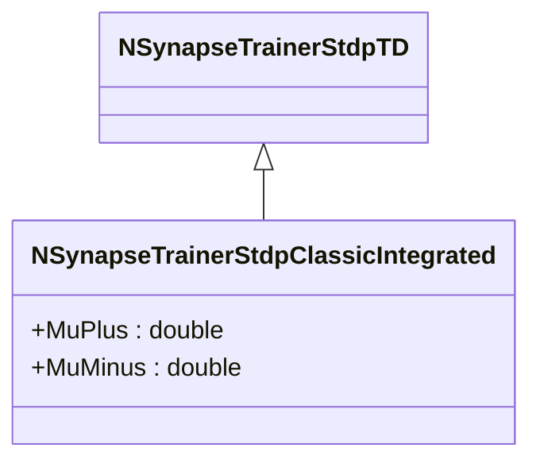

# NSynapseTrainerStdpClassicIntegrated — классический STDP (интегрированный)

## RU

### Назначение

**Класс**: `NSynapseTrainerStdpClassicIntegrated` — классический STDP с интегрированной реализацией.  
**Регистрация**: `NPulseLibrary.cpp` → `UploadClass("NSynapseTrainerStdpClassicIntegrated", ...)`.  
**Storage-инстансы**: `ClassName = "NSynapseTrainerStdpClassicIntegrated"` в `Bin/Configs/*/Model_*.xml`.

`NSynapseTrainerStdpClassicIntegrated` реализует классический STDP с интегрированной реализацией. Наследуется от `NSynapseTrainerStdpTD` и использует параметры `MuPlus` и `MuMinus` для управления зависимостью изменения веса. Интегрирует средние значения активности (`XAvg`, `YAvg`) для расчета изменения веса на каждом шаге.

**Использование:** Классический STDP с интегрированной реализацией, непрерывное интегрирование

### UML-диаграмма классов

### Свойства

#### Параметры (ptPubParameter)

- **`MuPlus`** (double) — параметр зависимости для LTP. Используется в формуле: `pow(1-(Weight-WMin)/WRange, MuPlus)`. Значение по умолчанию: 0.5

- **`MuMinus`** (double) — параметр зависимости для LTD. Используется в формуле: `pow((Weight-WMin+0.0001)/WRange, MuMinus)`. Значение по умолчанию: -4.0

**Наследуемые параметры:**
- `TauX = 1e-2`, `TauY = 5e-3`, `APlus = 5.0`, `AMinus = 1.0`

### Методы

- **`ACalculate()`** → `bool` — выполняет расчет классического STDP с интегрированием:
  1. Обновляет `XAvg` и `YAvg` на основе активности спайков
  2. Вычисляет изменение веса: `WeightOutput += (APlus * pow(...) * XAvg * IsOutputPulseActive - AMinus * pow(...) * YAvg * IsInputPulseActive) / TimeStep`
  3. Ограничивает вес в диапазоне `[WMin, WMax]`

### См. также

- [`NSynapseTrainerStdpTD`](NSynapseTrainerStdpTD.md) — STDP, зависящий от времени
- [`NSynapseTrainerStdpClassicDiscrete`](NSynapseTrainerStdpClassicDiscrete.md) — классический STDP (дискретный)
- [Architecture.md](../Architecture.md) — архитектура библиотеки

---

## EN

### Purpose

**Class**: `NSynapseTrainerStdpClassicIntegrated` — classic STDP with integrated implementation.  
**Registration**: `NPulseLibrary.cpp` → `UploadClass("NSynapseTrainerStdpClassicIntegrated", ...)`.  
**Instances**: `ClassName = "NSynapseTrainerStdpClassicIntegrated"` in `Bin/Configs/*/Model_*.xml`.

`NSynapseTrainerStdpClassicIntegrated` implements classic STDP with integrated implementation. Inherits from `NSynapseTrainerStdpTD` and uses parameters `MuPlus` and `MuMinus` to control weight dependence.

**Usage:** Classic STDP with integrated implementation, continuous integration

### UML Class Diagram

### See Also

- [`NSynapseTrainerStdpTD`](NSynapseTrainerStdpTD.md) — time-dependent STDP
- [`NSynapseTrainerStdpClassicDiscrete`](NSynapseTrainerStdpClassicDiscrete.md) — classic STDP (discrete)
- [Architecture.md](../Architecture.md) — library architecture
