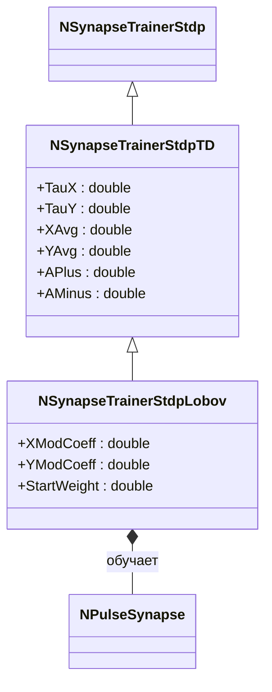
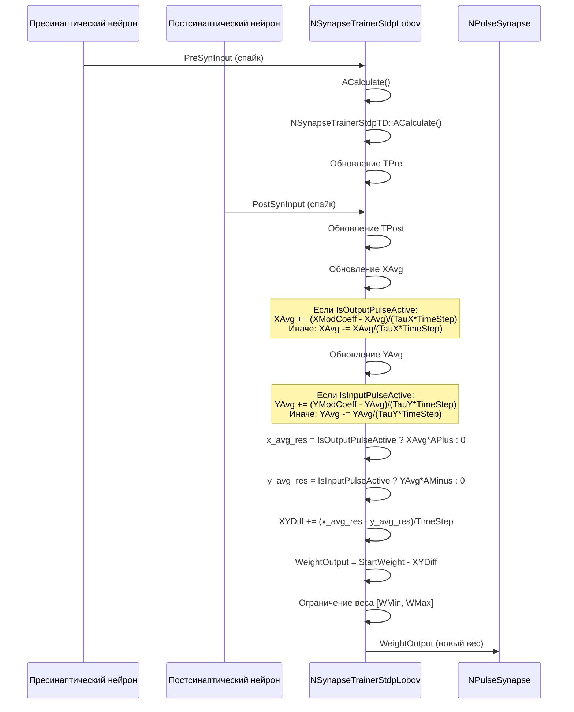
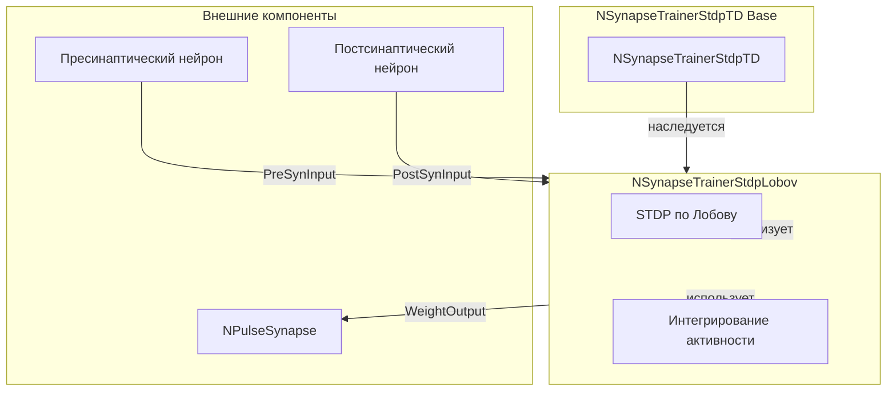
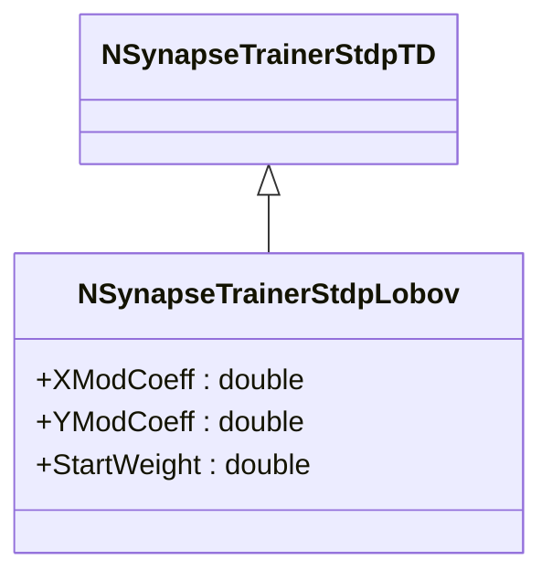
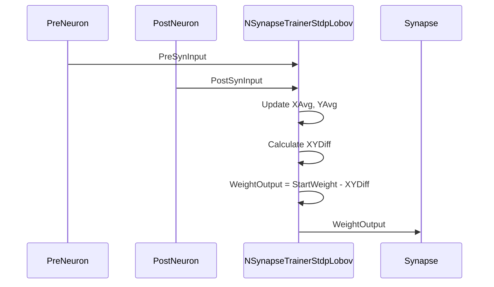
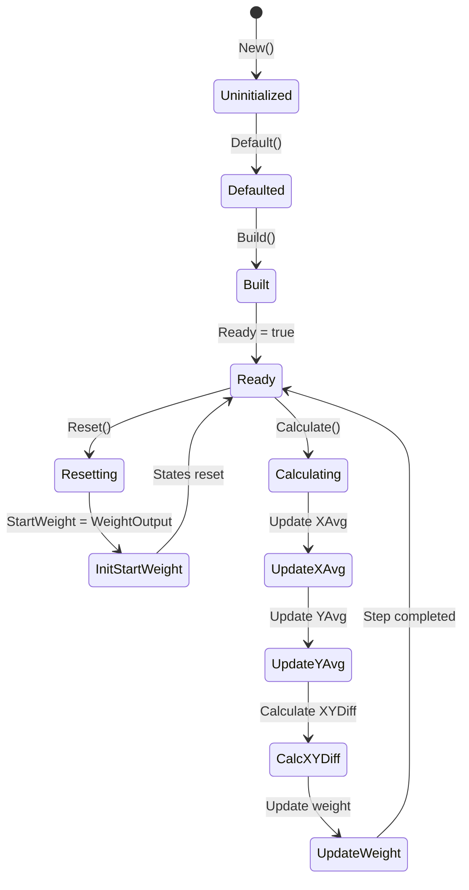
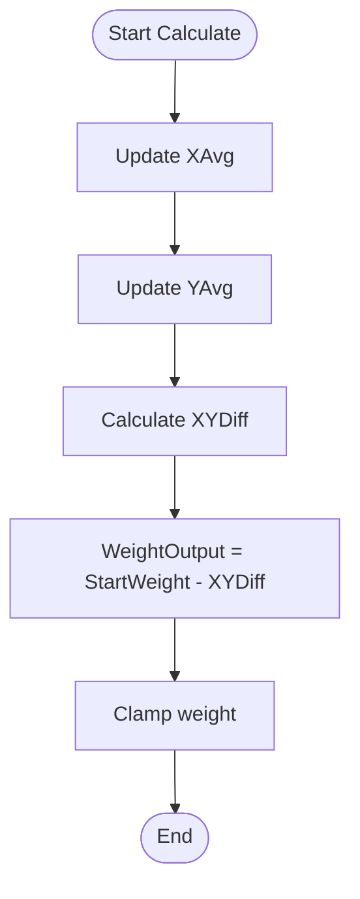

# NSynapseTrainerStdpLobov — STDP по Лобову

## RU

### Назначение

**Класс**: `NSynapseTrainerStdpLobov` — STDP-тренер по методу Лобова (изначальный вариант, не работает).  
**Аббревиатура**: `STDP` — **S**pike-**T**iming **D**ependent **P**lasticity (пластичность, зависящая от времени спайков).  
**Регистрация**: `NPulseLibrary.cpp` → `UploadClass("NSynapseTrainerStdpLobov", ...)`.  
**Storage-инстансы**: `ClassName = "NSynapseTrainerStdpLobov"` в `Bin/Configs/*/Model_*.xml`.

`NSynapseTrainerStdpLobov` реализует STDP по методу Лобова. Наследуется от `NSynapseTrainerStdpTD` и добавляет коэффициенты модификации (`XModCoeff`, `YModCoeff`) и начальный вес (`StartWeight`). Использует интегрирование средних значений активности (`XAvg`, `YAvg`) для расчета изменения веса.

**Использование:** STDP по методу Лобова, интегрирование активности

### UML-диаграмма классов



**Иерархия наследования:**
- `NSynapseTrainerStdp` — базовый STDP-тренер
- `NSynapseTrainerStdpTD` — STDP, зависящий от времени
- `NSynapseTrainerStdpLobov` — STDP по методу Лобова

### UML-диаграмма последовательности



**Жизненный цикл:**
1. **Инициализация**: Установка параметров по умолчанию (`XModCoeff=1.0`, `YModCoeff=1.0`, `APlus=5.0`, `AMinus=1.0`)
2. **Сброс**: Инициализация `StartWeight = WeightOutput`, обнуление `XAvg`, `YAvg`
3. **Расчет**: Интегрирование активности (`XAvg`, `YAvg`), вычисление изменения веса

### UML-диаграмма состояний

```mermaid
stateDiagram-v2
    [*] --> Uninitialized: New()
    Uninitialized --> Defaulted: Default()
    Defaulted --> Built: Build()
    Built --> Ready: Ready = true
    Ready --> Resetting: Reset()
    Resetting --> InitStartWeight: StartWeight = WeightOutput
    InitStartWeight --> Ready: Состояния сброшены
    Ready --> Calculating: Calculate()
    Calculating --> CheckTrainEnable{IsTrainEnable?}
    CheckTrainEnable -->|Нет| Ready: Обучение отключено
    CheckTrainEnable -->|Да| UpdateXAvg: Обновление XAvg
    UpdateXAvg --> UpdateYAvg: Обновление YAvg
    UpdateYAvg --> CalcXYDiff: XYDiff += (x_avg_res - y_avg_res)/TimeStep
    CalcXYDiff --> UpdateWeight: WeightOutput = StartWeight - XYDiff
    UpdateWeight --> ClampWeight: Ограничение [WMin, WMax]
    ClampWeight --> Ready: Шаг завершен
```

**Состояния:**
- **Uninitialized** — создан, но не инициализирован
- **Defaulted** — параметры установлены по умолчанию
- **Built** — структура тренера построена
- **Ready** — готов к выполнению расчетов
- **Resetting** — выполняется сброс
- **InitStartWeight** — инициализация StartWeight
- **Calculating** — выполняется расчет тренера
- **CheckTrainEnable** — проверка включения обучения
- **UpdateXAvg** — обновление средней активности X
- **UpdateYAvg** — обновление средней активности Y
- **CalcXYDiff** — вычисление изменения веса
- **UpdateWeight** — обновление веса синапса
- **ClampWeight** — ограничение веса в диапазоне [WMin, WMax]

### UML-диаграмма активности

```mermaid
flowchart TD
    Start([Start Calculate]) --> CallBase[NSynapseTrainerStdpTD::ACalculate]
    CallBase --> CheckTrainEnable{IsTrainEnable?}
    CheckTrainEnable -->|Нет| End([End])
    CheckTrainEnable -->|Да| UpdateXAvg{IsOutputPulseActive?}
    UpdateXAvg -->|Да| XAvgInc[XAvg += (XModCoeff - XAvg)/(TauX*TimeStep)]
    UpdateXAvg -->|Нет| XAvgDec[XAvg -= XAvg/(TauX*TimeStep)]
    XAvgInc --> UpdateYAvg{IsInputPulseActive?}
    XAvgDec --> UpdateYAvg
    UpdateYAvg -->|Да| YAvgInc[YAvg += (YModCoeff - YAvg)/(TauY*TimeStep)]
    UpdateYAvg -->|Нет| YAvgDec[YAvg -= YAvg/(TauY*TimeStep)]
    YAvgInc --> CalcXYDiff[XYDiff += (x_avg_res - y_avg_res)/TimeStep]
    YAvgDec --> CalcXYDiff
    CalcXYDiff --> UpdateWeight[WeightOutput = StartWeight - XYDiff]
    UpdateWeight --> ClampMin{WeightOutput < WMin?}
    ClampMin -->|Да| SetMin[WeightOutput = WMin]
    ClampMin -->|Нет| ClampMax{WeightOutput > WMax?}
    ClampMax -->|Да| SetMax[WeightOutput = WMax]
    ClampMax -->|Нет| WriteFile[Запись в файл]
    SetMin --> WriteFile
    SetMax --> WriteFile
    WriteFile --> End
```

**Алгоритм расчета:**
1. Вызов базового расчета (`NSynapseTrainerStdpTD::ACalculate()`)
2. Обновление средней активности X (`XAvg`):
   - Если `IsOutputPulseActive`: `XAvg += (XModCoeff - XAvg)/(TauX*TimeStep)`
   - Иначе: `XAvg -= XAvg/(TauX*TimeStep)`
3. Обновление средней активности Y (`YAvg`):
   - Если `IsInputPulseActive`: `YAvg += (YModCoeff - YAvg)/(TauY*TimeStep)`
   - Иначе: `YAvg -= YAvg/(TauY*TimeStep)`
4. Вычисление изменения веса: `XYDiff += (x_avg_res - y_avg_res)/TimeStep`, где `x_avg_res = IsOutputPulseActive ? XAvg*APlus : 0`, `y_avg_res = IsInputPulseActive ? YAvg*AMinus : 0`
5. Обновление веса: `WeightOutput = StartWeight - XYDiff`
6. Ограничение веса в диапазоне `[WMin, WMax]`

### UML-диаграмма компонентов



**Зависимости:**
- **Базовый класс**: `NSynapseTrainerStdpTD`
- **Внутренние компоненты**: STDP по Лобову (интегрирование активности), коэффициенты модификации (`XModCoeff`, `YModCoeff`)
- **Внешние компоненты**: пресинаптический нейрон (источник `PreSynInput`), постсинаптический нейрон (источник `PostSynInput`), синапс (получатель `WeightOutput`)

### Свойства

#### Параметры (ptPubParameter)

- **`XModCoeff`** (double) — коэффициент модификации для переменной X. Значение по умолчанию: 1.0

- **`YModCoeff`** (double) — коэффициент модификации для переменной Y. Значение по умолчанию: 1.0

- **`StartWeight`** (double) — начальный вес синапса. Устанавливается в `AReset()` из текущего значения `WeightOutput`

**Наследуемые параметры:**
- `APlus = 5.0`, `AMinus = 1.0`, `TauX = 1e-2`, `TauY = 5e-3`

### Методы

- **`ACalculate()`** → `bool` — выполняет расчет STDP по Лобову:
  1. Обновляет `XAvg` и `YAvg` на основе активности спайков
  2. Вычисляет изменение веса: `WeightOutput = StartWeight - XYDiff`
  3. Ограничивает вес в диапазоне `[WMin, WMax]`

### Использование в конфигурациях

`NSynapseTrainerStdpLobov` используется в экспериментах с STDP по методу Лобова:

- **STDP по Лобову**: `Bin/Configs/!OldConfigs/*/Model_*.xml` (где требуется STDP с интегрированием активности)

**Типичные значения параметров:**
- **XModCoeff**: 1.0 (коэффициент модификации для X)
- **YModCoeff**: 1.0 (коэффициент модификации для Y)
- **APlus**: 5.0 (амплитуда LTP)
- **AMinus**: 1.0 (амплитуда LTD)
- **TauX**: 1e-2 (10 мс, постоянная времени для X)
- **TauY**: 5e-3 (5 мс, постоянная времени для Y)
- **StartWeight**: устанавливается в `AReset()` из текущего значения `WeightOutput`

**Особенности:**
- Интегрирование активности: использует средние значения активности (`XAvg`, `YAvg`)
- Формула веса: `WeightOutput = StartWeight - XYDiff` (относительно начального веса)
- Обновление XAvg/YAvg: зависит от активности спайков и временных констант

### См. также

- [`NSynapseTrainerStdpTD`](NSynapseTrainerStdpTD.md) — STDP, зависящий от времени
- [`NSynapseTrainerStdp`](NSynapseTrainerStdp.md) — базовый STDP-тренер
- [Architecture.md](../Architecture.md) — архитектура библиотеки

---

## EN

### Purpose

**Class**: `NSynapseTrainerStdpLobov` — Lobov STDP trainer.  
**Registration**: `NPulseLibrary.cpp` → `UploadClass("NSynapseTrainerStdpLobov", ...)`.  
**Instances**: `ClassName = "NSynapseTrainerStdpLobov"` in `Bin/Configs/*/Model_*.xml`.

`NSynapseTrainerStdpLobov` implements Lobov STDP method. Inherits from `NSynapseTrainerStdpTD` and adds modification coefficients (`XModCoeff`, `YModCoeff`) and start weight (`StartWeight`).

**Usage:** Lobov STDP method, activity integration

### UML Class Diagram



### UML Sequence Diagram



### UML State Diagram



### UML Activity Diagram



### See Also

- [`NSynapseTrainerStdpTD`](NSynapseTrainerStdpTD.md) — time-dependent STDP
- [`NSynapseTrainerStdp`](NSynapseTrainerStdp.md) — base STDP trainer
- [Architecture.md](../Architecture.md) — library architecture
