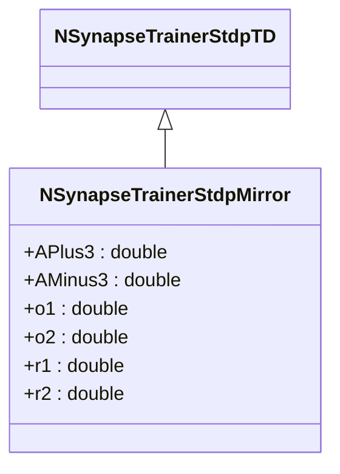

# NSynapseTrainerStdpMirror — STDP Mirror

## RU

### Назначение

**Класс**: `NSynapseTrainerStdpMirror` — STDP-тренер с зеркальным правилом.
**Регистрация**: `NPulseLibrary.cpp` → `UploadClass("NSynapseTrainerStdpMirror", ...)`.
**Storage-инстансы**: `ClassName = "NSynapseTrainerStdpMirror"` в `Bin/Configs/*/Model_*.xml`.

`NSynapseTrainerStdpMirror` реализует STDP с зеркальным правилом, которое использует дополнительные переменные состояния (`o1`, `o2`, `r1`, `r2`) для отслеживания истории спайков. Наследуется от `NSynapseTrainerStdpTD` и добавляет параметры `APlus3` и `AMinus3` для управления зеркальными эффектами. Соответствует M-STDP по ВКР Зарубина: «зеркальное» окно относительно постсинаптического спайка; формулы (2.14)–(2.23) в [B] — обновление переменных r1, r2, o1, o2 в моменты t_pre и t_post.

**Использование:** STDP с зеркальным правилом, отслеживание истории спайков

### UML-диаграмма классов

### Свойства

#### Параметры (ptPubParameter)

- **`APlus3`** (double) — коэффициент усиления для зеркального LTP. Значение по умолчанию: 0.091

- **`AMinus3`** (double) — коэффициент ослабления для зеркального LTD. Значение по умолчанию: 0.075

#### Состояния (ptPubState)

- **`o1`** (double) — переменная состояния для отслеживания истории постсинаптических спайков. Начальное значение: 0.0

- **`o2`** (double) — переменная состояния для отслеживания истории постсинаптических спайков. Начальное значение: 0.0

- **`r1`** (double) — переменная состояния для отслеживания истории пресинаптических спайков. Начальное значение: 0.0

- **`r2`** (double) — переменная состояния для отслеживания истории пресинаптических спайков. Начальное значение: 0.0

**Наследуемые параметры:**
- `APlus = 0.046`, `AMinus = 0.03`, `TauPlus = 0.0168`, `TauMinus = 0.0337`, `TauX = 0.575`, `TauY = 0.047`

### Методы

- **`ACalculate()`** → `bool` — выполняет расчет зеркального STDP:
  1. Обновляет переменные состояния `o1`, `o2`, `r1`, `r2` с учетом временных констант
  2. Для пресинаптического спайка: `WeightOutput -= o1 * (AMinus + AMinus3 * r2)`, обновляет `r1` и `r2`
  3. Для постсинаптического спайка: `WeightOutput += r1 * (APlus + APlus3 * o2)`, обновляет `o1` и `o2`

## Источники

См. [Literature-References.md](../Literature-References.md): **[B]**.

### См. также

- [`NSynapseTrainerStdpTD`](NSynapseTrainerStdpTD.md) — STDP, зависящий от времени
- [`NSynapseTrainerStdpTriplet`](NSynapseTrainerStdpTriplet.md) — STDP Triplet
- [Architecture.md](../Architecture.md) — архитектура библиотеки

---

## EN

### Purpose

**Class**: `NSynapseTrainerStdpMirror` — STDP trainer with mirror rule.
**Registration**: `NPulseLibrary.cpp` → `UploadClass("NSynapseTrainerStdpMirror", ...)`.
**Instances**: `ClassName = "NSynapseTrainerStdpMirror"` in `Bin/Configs/*/Model_*.xml`.

`NSynapseTrainerStdpMirror` implements STDP with mirror rule, which uses additional state variables (`o1`, `o2`, `r1`, `r2`) to track spike history. Inherits from `NSynapseTrainerStdpTD` and adds parameters `APlus3` and `AMinus3` for mirror effects. Corresponds to M-STDP in Zarubin's thesis: mirror window relative to postsynaptic spike; formulas (2.14)–(2.23) in [B] — update of r1, r2, o1, o2 at t_pre and t_post.

**Usage:** STDP with mirror rule, spike history tracking

### UML Class Diagram

### References

See [Literature-References.md](../Literature-References.md): **[B]**.

### See Also

- [`NSynapseTrainerStdpTD`](NSynapseTrainerStdpTD.md) — time-dependent STDP
- [`NSynapseTrainerStdpTriplet`](NSynapseTrainerStdpTriplet.md) — STDP Triplet
- [Architecture.md](../Architecture.md) — library architecture
