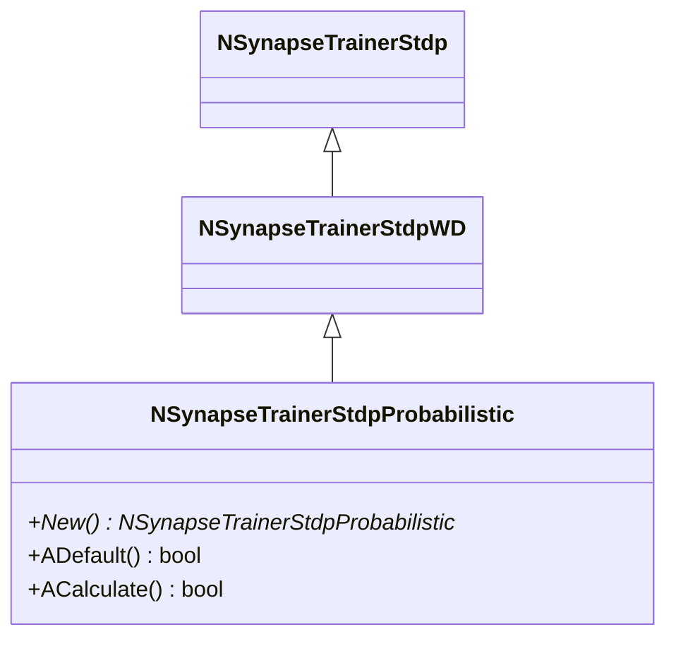
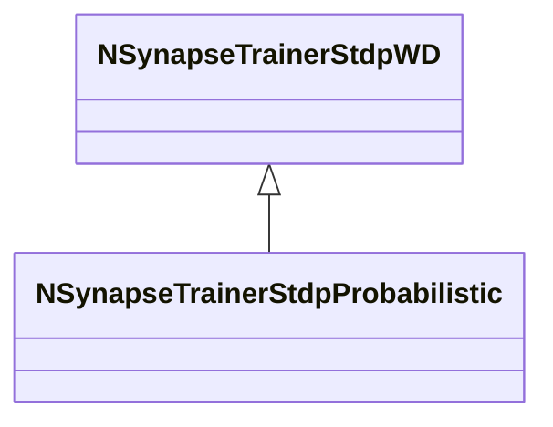

# NSynapseTrainerStdpProbabilistic — вероятностный STDP

## RU

### Назначение

**Класс**: `NSynapseTrainerStdpProbabilistic` — вероятностный STDP-тренер.  
**Регистрация**: `NPulseLibrary.cpp` → `UploadClass("NSynapseTrainerStdpProbabilistic", ...)`.  
**Storage-инстансы**: `ClassName = "NSynapseTrainerStdpProbabilistic"` в `Bin/Configs/*/Model_*.xml`.

`NSynapseTrainerStdpProbabilistic` реализует вероятностный STDP, где изменение веса зависит от текущего веса синапса. Наследуется от `NSynapseTrainerStdpWD` и использует экспоненциальную зависимость от веса для LTP: `XYDiff = APlus * exp(-WeightOutput)`.

**Использование:** Вероятностный STDP, зависимость от веса

### UML-диаграмма классов

### Свойства

`NSynapseTrainerStdpProbabilistic` использует все свойства базового класса `NSynapseTrainerStdpWD` с параметрами по умолчанию:
- `APlus = 0.01`, `AMinus = 0.01`

### Методы

- **`ACalculate()`** → `bool` — выполняет расчет вероятностного STDP:
  - Если `TDiff > 0` (LTP): `XYDiff = APlus * exp(-WeightOutput)`
  - Если `TDiff < 0` (LTD): `XYDiff = -AMinus`
  - Обновляет вес: `WeightOutput += XYDiff`
  - Ограничивает вес в диапазоне `[WMin, WMax]`
  - Игнорирует изменения, если `abs(TDiff) >= 0.1`

### См. также

- [`NSynapseTrainerStdpWD`](NSynapseTrainerStdpWD.md) — STDP, зависящий от веса
- [`NSynapseTrainerStdpStable`](NSynapseTrainerStdpStable.md) — стабильный STDP
- [Architecture.md](../Architecture.md) — архитектура библиотеки

---

## EN

### Purpose

**Class**: `NSynapseTrainerStdpProbabilistic` — probabilistic STDP trainer.  
**Registration**: `NPulseLibrary.cpp` → `UploadClass("NSynapseTrainerStdpProbabilistic", ...)`.  
**Instances**: `ClassName = "NSynapseTrainerStdpProbabilistic"` in `Bin/Configs/*/Model_*.xml`.

`NSynapseTrainerStdpProbabilistic` implements probabilistic STDP, where weight change depends on current synapse weight. Inherits from `NSynapseTrainerStdpWD` and uses exponential weight dependence for LTP.

**Usage:** Probabilistic STDP, weight dependence

### UML Class Diagram

### See Also

- [`NSynapseTrainerStdpWD`](NSynapseTrainerStdpWD.md) — weight-dependent STDP
- [`NSynapseTrainerStdpStable`](NSynapseTrainerStdpStable.md) — stable STDP
- [Architecture.md](../Architecture.md) — library architecture
