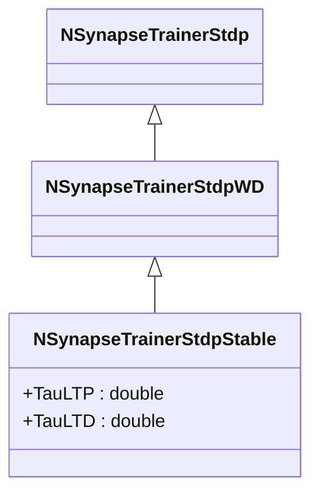
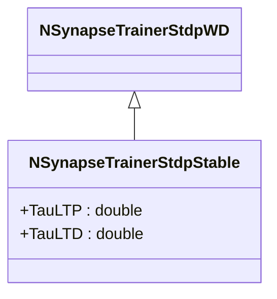

# NSynapseTrainerStdpStable — стабильный STDP

## RU

### Назначение

**Класс**: `NSynapseTrainerStdpStable` — стабильный STDP-тренер.  
**Регистрация**: `NPulseLibrary.cpp` → `UploadClass("NSynapseTrainerStdpStable", ...)`.  
**Storage-инстансы**: `ClassName = "NSynapseTrainerStdpStable"` в `Bin/Configs/*/Model_*.xml`.

`NSynapseTrainerStdpStable` реализует стабильный STDP, который использует временные окна (`TauLTP`, `TauLTD`) для определения, когда применять LTP или LTD. Наследуется от `NSynapseTrainerStdpWD` и добавляет параметры для управления временными окнами пластичности.

**Использование:** Стабильный STDP, временные окна пластичности

### UML-диаграмма классов

### Свойства

#### Параметры (ptPubParameter)

- **`TauLTP`** (double) — временное окно для LTP. Если `TPost - TPre < TauLTP`, применяется LTP. Значение по умолчанию: 0.02

- **`TauLTD`** (double) — временное окно для LTD. Если `TPre - TPost < TauLTD`, применяется LTD. Значение по умолчанию: 0.0

**Наследуемые параметры:**
- `APlus = 0.01`, `AMinus = 0.01`

### Методы

- **`ACalculate()`** → `bool` — выполняет расчет стабильного STDP:
  - Если `TPost - TPre < TauLTP` и `TPost - TPre > TauLTD` (LTP): `WeightOutput += APlus * exp(-WeightOutput)`
  - Если `TPost - TPre > TauLTP` или `TPre - TPost < TauLTD` (LTD): `WeightOutput -= AMinus * exp(WeightOutput)`
  - Ограничивает вес в диапазоне `[WMin, WMax]`

### См. также

- [`NSynapseTrainerStdpWD`](NSynapseTrainerStdpWD.md) — STDP, зависящий от веса
- [`NSynapseTrainerStdpProbabilistic`](NSynapseTrainerStdpProbabilistic.md) — вероятностный STDP
- [Architecture.md](../Architecture.md) — архитектура библиотеки

---

## EN

### Purpose

**Class**: `NSynapseTrainerStdpStable` — stable STDP trainer.  
**Registration**: `NPulseLibrary.cpp` → `UploadClass("NSynapseTrainerStdpStable", ...)`.  
**Instances**: `ClassName = "NSynapseTrainerStdpStable"` in `Bin/Configs/*/Model_*.xml`.

`NSynapseTrainerStdpStable` implements stable STDP, which uses time windows (`TauLTP`, `TauLTD`) to determine when to apply LTP or LTD. Inherits from `NSynapseTrainerStdpWD` and adds parameters for managing plasticity time windows.

**Usage:** Stable STDP, plasticity time windows

### UML Class Diagram

### See Also

- [`NSynapseTrainerStdpWD`](NSynapseTrainerStdpWD.md) — weight-dependent STDP
- [`NSynapseTrainerStdpProbabilistic`](NSynapseTrainerStdpProbabilistic.md) — probabilistic STDP
- [Architecture.md](../Architecture.md) — library architecture
