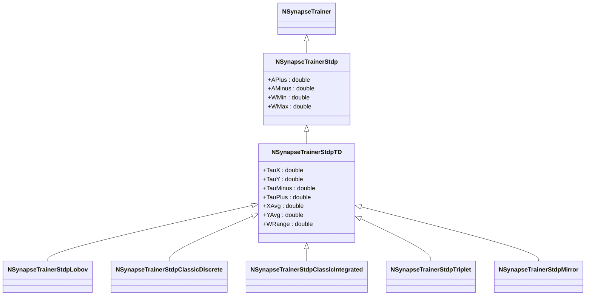
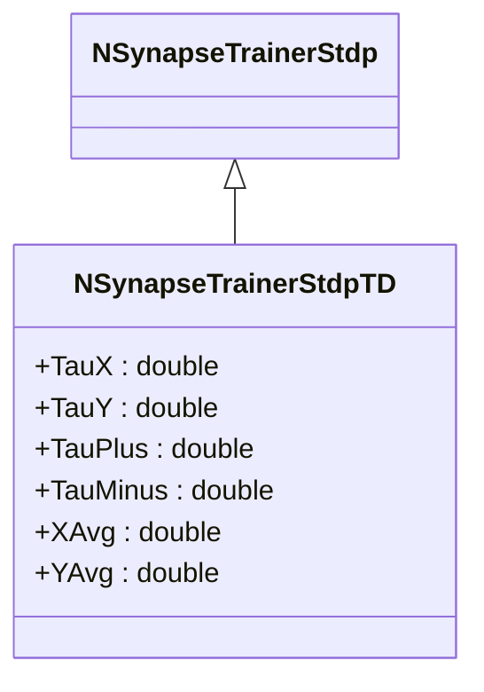

# NSynapseTrainerStdpTD — STDP-тренер, зависящий от времени

## RU

### Назначение

**Класс**: `NSynapseTrainerStdpTD` — STDP-тренер, зависящий от времени напрямую (Time-Dependent).  
**Регистрация**: `NPulseLibrary.cpp` → `UploadClass("NSynapseTrainerStdpTD", ...)`.  
**Storage-инстансы**: `ClassName = "NSynapseTrainerStdpTD"` в `Bin/Configs/*/Model_*.xml`.

`NSynapseTrainerStdpTD` реализует STDP-обучение, зависящее от времени напрямую. Наследуется от `NSynapseTrainerStdp` и добавляет параметры для управления временными константами и средними значениями активности (`XAvg`, `YAvg`). Используется как базовый класс для многих вариантов STDP (Lobov, Classic, Triplet, Mirror).

**Использование:** Базовый класс для STDP-тренеров, зависящих от времени, управление временными константами

### UML-диаграмма классов



**Иерархия наследования:**
- `NSynapseTrainer` — базовый тренер синапсов
- `NSynapseTrainerStdp` — базовый STDP-тренер
- `NSynapseTrainerStdpTD` — STDP, зависящий от времени

### Свойства

#### Параметры (ptPubParameter)

- **`TauX`** (double) — постоянная времени для переменной X (постсинаптическая активность). Значение по умолчанию: зависит от производного класса

- **`TauY`** (double) — постоянная времени для переменной Y (пресинаптическая активность). Значение по умолчанию: зависит от производного класса

- **`TauMinus`** (double) — постоянная времени для LTD (Long-Term Depression). Значение по умолчанию: зависит от производного класса

- **`TauPlus`** (double) — постоянная времени для LTP (Long-Term Potentiation). Значение по умолчанию: зависит от производного класса

- **`XAvg`** (double) — среднее значение переменной X (постсинаптическая активность). Значение по умолчанию: 0.0

- **`YAvg`** (double) — среднее значение переменной Y (пресинаптическая активность). Значение по умолчанию: 0.0

#### Состояния (ptPubState)

- **`WRange`** (double) — диапазон весов (`WMax - WMin`). Вычисляется автоматически в `ADefault()`

### Методы

`NSynapseTrainerStdpTD` использует все методы базового класса `NSynapseTrainerStdp` и переопределяет:

- **`ADefault()`** → `bool` — инициализирует параметры по умолчанию. Вызывает `NSynapseTrainerStdp::ADefault()`, устанавливает `XAvg = 0.0`, `YAvg = 0.0`, вычисляет `WRange = WMax - WMin`.

- **`AReset()`** → `bool` — сбрасывает состояния. Вызывает `NSynapseTrainerStdp::AReset()`, устанавливает `XAvg = 0.0`, `YAvg = 0.0`.

- **`ACalculate()`** → `bool` — выполняет расчет. Вызывает `NSynapseTrainerStdp::ACalculate()` для отслеживания спайков. Конкретное правило изменения весов реализуется в производных классах.

### Примеры использования

#### Пример 1: Создание тренера в коде C++

```cpp
// Создание STDP-тренера TD
auto trainer = storage->CreateComponent<NSynapseTrainerStdpTD>();
trainer->SetName("STDPTrainerTD");

// Инициализация
trainer->Default();

// Настройка параметров
trainer->APlus = 0.01;
trainer->AMinus = 0.01;
trainer->TauX = 0.01;
trainer->TauY = 0.005;
trainer->TauPlus = 0.01;
trainer->TauMinus = 0.02;
trainer->WMin = 0.0;
trainer->WMax = 1.0;

// Сборка
trainer->Build();
```

## Источники

См. [Literature-References.md](../Literature-References.md): **[B]**.

### См. также

- [`NSynapseTrainerStdp`](NSynapseTrainerStdp.md) — базовый STDP-тренер
- [`NSynapseTrainerStdpLobov`](NSynapseTrainerStdpLobov.md) — STDP по Лобову
- [`NSynapseTrainerStdpClassicDiscrete`](NSynapseTrainerStdpClassicDiscrete.md) — классический STDP (дискретный)
- [`NSynapseTrainerStdpTriplet`](NSynapseTrainerStdpTriplet.md) — STDP Triplet
- [Architecture.md](../Architecture.md) — архитектура библиотеки

---

## EN

### Purpose

**Class**: `NSynapseTrainerStdpTD` — time-dependent STDP trainer.  
**Registration**: `NPulseLibrary.cpp` → `UploadClass("NSynapseTrainerStdpTD", ...)`.  
**Instances**: `ClassName = "NSynapseTrainerStdpTD"` in `Bin/Configs/*/Model_*.xml`.

`NSynapseTrainerStdpTD` implements time-dependent STDP learning. Inherits from `NSynapseTrainerStdp` and adds parameters for managing time constants and average activity values (`XAvg`, `YAvg`).

**Usage:** Base class for time-dependent STDP trainers, time constant management

### UML Class Diagram



### References

See [Literature-References.md](../Literature-References.md): **[B]**.

### See Also

- [`NSynapseTrainerStdp`](NSynapseTrainerStdp.md) — base STDP trainer
- [`NSynapseTrainerStdpLobov`](NSynapseTrainerStdpLobov.md) — Lobov STDP
- [Architecture.md](../Architecture.md) — library architecture
