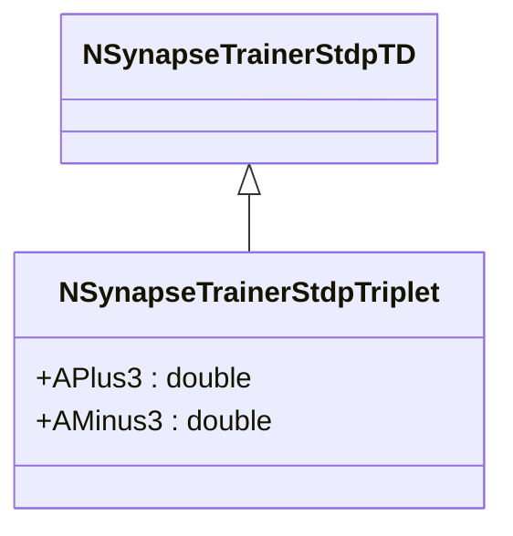

# NSynapseTrainerStdpTriplet — STDP Triplet

## RU

### Назначение

**Класс**: `NSynapseTrainerStdpTriplet` — STDP-тренер с триплетным правилом.
**Регистрация**: `NPulseLibrary.cpp` → `UploadClass("NSynapseTrainerStdpTriplet", ...)`.
**Storage-инстансы**: `ClassName = "NSynapseTrainerStdpTriplet"` в `Bin/Configs/*/Model_*.xml`.

`NSynapseTrainerStdpTriplet` реализует STDP с триплетным правилом, которое учитывает не только пары спайков (pre-post), но и триплеты спайков. Наследуется от `NSynapseTrainerStdpTD` и добавляет параметры `APlus3` и `AMinus3` для управления триплетными эффектами. Соответствует T-STDP по ВКР Зарубина: формула (2.13) в [B]; обозначения Δt₁, Δt₂, Δt₃, A2+/A3+, A2-/A3-, τy, τx (в коде — TauX, TauY и др.).

**Использование:** STDP с триплетным правилом, учет триплетов спайков

### UML-диаграмма классов

### Свойства

#### Параметры (ptPubParameter)

- **`APlus3`** (double) — коэффициент усиления для триплетного LTP. Значение по умолчанию: 0.01

- **`AMinus3`** (double) — коэффициент ослабления для триплетного LTD. Значение по умолчанию: 0.01

**Наследуемые параметры:**
- `APlus = 0.01`, `AMinus = 0.01`, `TauPlus = 0.01`, `TauMinus = 0.01`, `TauX = 0.01`, `TauY = 0.01`

### Методы

- **`ACalculate()`** → `bool` — выполняет расчет триплетного STDP:
  - Для постсинаптического спайка: `WeightOutput += exp(-delta_t1/TauPlus) * (APlus + APlus3 * exp(-delta_t2/TauY))`
  - Для пресинаптического спайка: `WeightOutput -= exp(delta_t1/TauMinus) * (AMinus + AMinus3 * exp(-delta_t3/TauX))`
  - Где `delta_t1 = TPost - TPre`, `delta_t2 = TPost - TPostOld`, `delta_t3 = TPre - TPreOld`

## Источники

См. [Literature-References.md](../Literature-References.md): **[B]**.

### См. также

- [`NSynapseTrainerStdpTD`](NSynapseTrainerStdpTD.md) — STDP, зависящий от времени
- [`NSynapseTrainerStdpMirror`](NSynapseTrainerStdpMirror.md) — STDP Mirror
- [Architecture.md](../Architecture.md) — архитектура библиотеки

---

## EN

### Purpose

**Class**: `NSynapseTrainerStdpTriplet` — STDP trainer with triplet rule.
**Registration**: `NPulseLibrary.cpp` → `UploadClass("NSynapseTrainerStdpTriplet", ...)`.
**Instances**: `ClassName = "NSynapseTrainerStdpTriplet"` in `Bin/Configs/*/Model_*.xml`.

`NSynapseTrainerStdpTriplet` implements STDP with triplet rule, which considers not only spike pairs (pre-post) but also spike triplets. Inherits from `NSynapseTrainerStdpTD` and adds parameters `APlus3` and `AMinus3` for triplet effects. Corresponds to T-STDP in Zarubin's thesis: formula (2.13) in [B]; notation Δt₁, Δt₂, Δt₃, A2+/A3+, A2-/A3-, τy, τx (TauX, TauY in code).

**Usage:** STDP with triplet rule, spike triplet consideration

### UML Class Diagram

### References

See [Literature-References.md](../Literature-References.md): **[B]**.

### See Also

- [`NSynapseTrainerStdpTD`](NSynapseTrainerStdpTD.md) — time-dependent STDP
- [`NSynapseTrainerStdpMirror`](NSynapseTrainerStdpMirror.md) — STDP Mirror
- [Architecture.md](../Architecture.md) — library architecture
