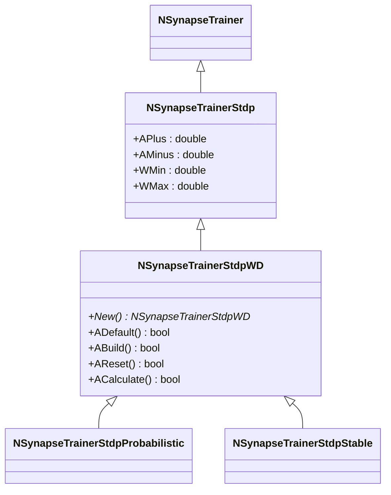
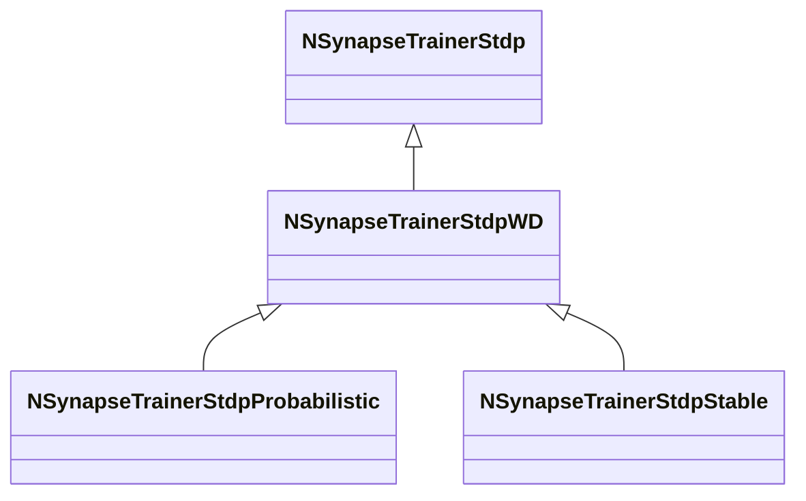

# NSynapseTrainerStdpWD — STDP-тренер, зависящий от веса

## RU

### Назначение

**Класс**: `NSynapseTrainerStdpWD` — STDP-тренер, зависящий от веса напрямую (Weight-Dependent).  
**Регистрация**: `NPulseLibrary.cpp` → `UploadClass("NSynapseTrainerStdpWD", ...)`.  
**Storage-инстансы**: `ClassName = "NSynapseTrainerStdpWD"` в `Bin/Configs/*/Model_*.xml`.

`NSynapseTrainerStdpWD` реализует STDP-обучение, зависящее от веса напрямую. Наследуется от `NSynapseTrainerStdp` и используется как базовый класс для вероятностных и стабильных вариантов STDP. В отличие от `NSynapseTrainerStdpTD`, не использует временные константы для средних значений активности.

**Использование:** Базовый класс для STDP-тренеров, зависящих от веса, вероятностные и стабильные варианты STDP

### UML-диаграмма классов



**Иерархия наследования:**
- `NSynapseTrainer` — базовый тренер синапсов
- `NSynapseTrainerStdp` — базовый STDP-тренер
- `NSynapseTrainerStdpWD` — STDP, зависящий от веса

### Свойства

`NSynapseTrainerStdpWD` использует все свойства базового класса `NSynapseTrainerStdp` без дополнительных параметров.

### Методы

`NSynapseTrainerStdpWD` использует все методы базового класса `NSynapseTrainerStdp`:

- **`ADefault()`** → `bool` — инициализирует параметры по умолчанию. Вызывает `NSynapseTrainerStdp::ADefault()`.

- **`AReset()`** → `bool` — сбрасывает состояния. Вызывает `NSynapseTrainerStdp::AReset()`.

- **`ACalculate()`** → `bool` — выполняет расчет. Вызывает `NSynapseTrainerStdp::ACalculate()` для отслеживания спайков. Конкретное правило изменения весов реализуется в производных классах.

### Примеры использования

#### Пример 1: Создание тренера в коде C++

```cpp
// Создание STDP-тренера WD
auto trainer = storage->CreateComponent<NSynapseTrainerStdpWD>();
trainer->SetName("STDPTrainerWD");

// Инициализация
trainer->Default();

// Настройка параметров
trainer->APlus = 0.01;
trainer->AMinus = 0.01;
trainer->WMin = 0.0;
trainer->WMax = 1.0;

// Сборка
trainer->Build();
```

### См. также

- [`NSynapseTrainerStdp`](NSynapseTrainerStdp.md) — базовый STDP-тренер
- [`NSynapseTrainerStdpProbabilistic`](NSynapseTrainerStdpProbabilistic.md) — вероятностный STDP
- [`NSynapseTrainerStdpStable`](NSynapseTrainerStdpStable.md) — стабильный STDP
- [Architecture.md](../Architecture.md) — архитектура библиотеки

---

## EN

### Purpose

**Class**: `NSynapseTrainerStdpWD` — weight-dependent STDP trainer.  
**Registration**: `NPulseLibrary.cpp` → `UploadClass("NSynapseTrainerStdpWD", ...)`.  
**Instances**: `ClassName = "NSynapseTrainerStdpWD"` in `Bin/Configs/*/Model_*.xml`.

`NSynapseTrainerStdpWD` implements weight-dependent STDP learning. Inherits from `NSynapseTrainerStdp` and is used as base class for probabilistic and stable STDP variants.

**Usage:** Base class for weight-dependent STDP trainers, probabilistic and stable STDP variants

### UML Class Diagram



### See Also

- [`NSynapseTrainerStdp`](NSynapseTrainerStdp.md) — base STDP trainer
- [`NSynapseTrainerStdpProbabilistic`](NSynapseTrainerStdpProbabilistic.md) — probabilistic STDP
- [`NSynapseTrainerStdpStable`](NSynapseTrainerStdpStable.md) — stable STDP
- [Architecture.md](../Architecture.md) — library architecture
