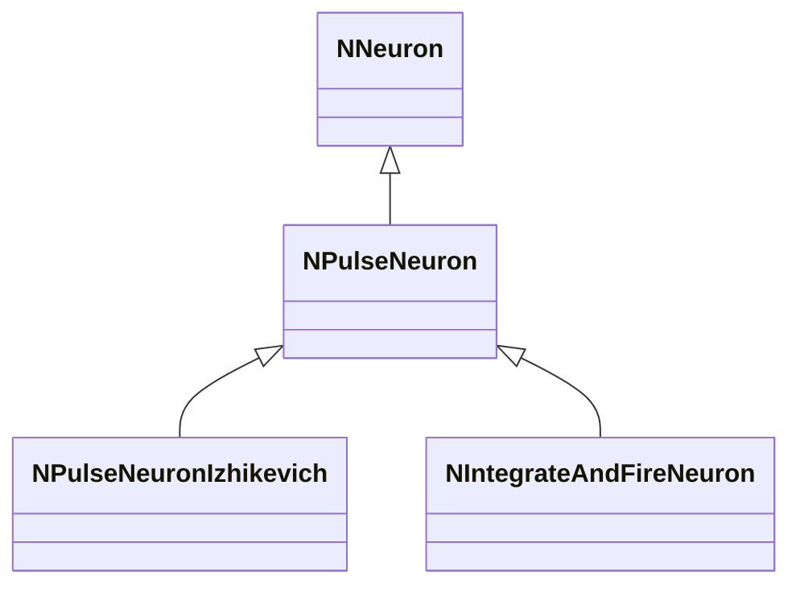

## RU

## Нейроны — NNeuron, NPulseNeuron* и семейства (Nmsdk-PulseLib)

Группа нейронных классов реализует различные модели (Izhikevich, IaF, Cable, Hebb, LP/SP/TCN и др.), а также афферентные, моторные и обучающиеся нейроны.

### Базовые классы

- `NNeuron` — абстрактный базовый нейрон.
- `NPulseNeuron` — импульсный нейрон с общими полями/методами.
- `NPulseNeuronIzhikevich`, `NIntegrateAndFireNeuron`, `NPulseNeuronCable`, `NPulseNeuronCableMulti` — конкретные модели.
- `NPLifeNeuron`, `NPulseLifeNeuron` — варианты с жизненным циклом/метриками.

### Афферентные и обучающиеся

- `NAfferentNeuron`, `NSAfferentNeuron`, `NSimpleAfferentNeuron` — получение внешних стимулов.
- `NContinuesSAfferentNeuron`, `NContinuesSimpleAfferentNeuron` — непрерывные варианты.
- `NNeuronLearner`, `NNeuronTrainer` — самообучающиеся/тренируемые нейроны.

### Моторные и специальные

- `NMotoneuron`, `NRenshowCell` — моторные и интернейроны Реншоу.
- Частотные группы: `NNeuronFreqGroup`, `NNeuronFreqGroupLayer` (слои частотных нейронов).

### Storage-инстансы

Во всех случаях класс регистрируется в `NPulseLibrary.cpp` через `UploadClass("ИмяКласса", ...)`.
Экземпляры в `UStorage` конфигурируются через `ClassName` и параметры модели (ёмкость мембраны, токи, веса, пороги и т.п.).

## Источники

См. [Literature-References.md](../Literature-References.md): **[A]**, **4**, **25**, **29**.

---

## EN

## Neurons — families overview (Nmsdk-PulseLib)

Describes base neuron types, spike models and specialised neuron classes used in SNN networks.

### References

See [Literature-References.md](../Literature-References.md): **[A]**, **4**, **25**, **29**.

