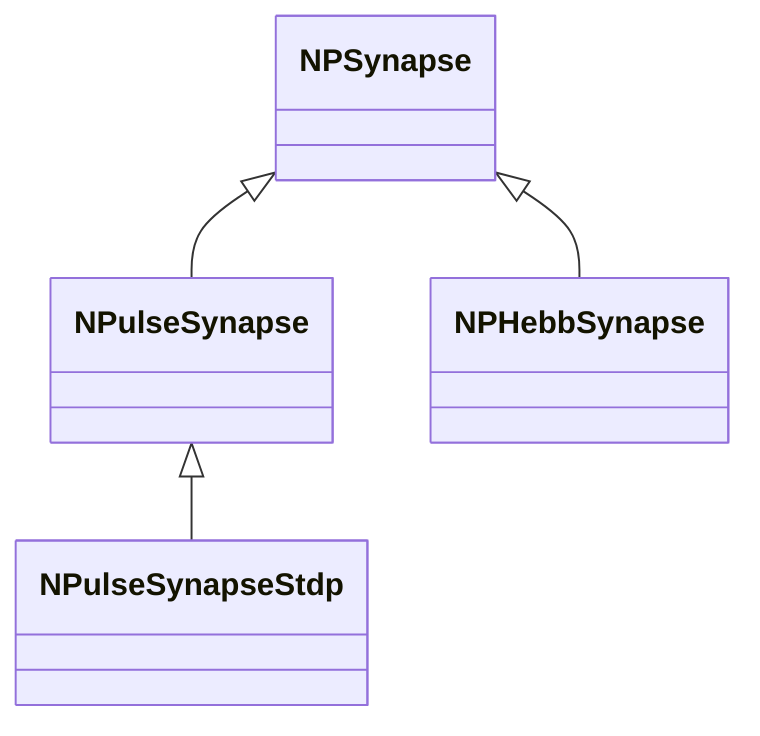
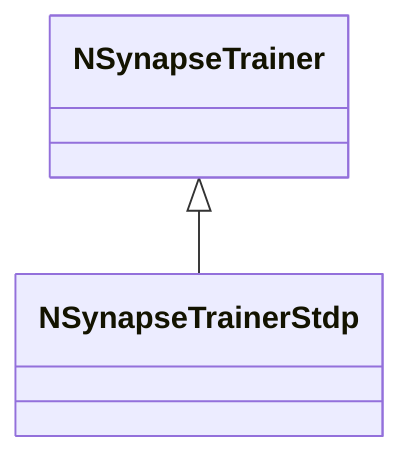

## RU

## Синапсы и тренеры — NPSynapse*, NSynapse*, NSynapseTrainer* (Nmsdk-PulseLib)

Группа реализует передаточные элементы (синапсы) и обучающие модули (тренеры STDP и др.).

### Синапсы

- `NPSynapse`, `NPSynapseBio/Bio2` — базовые импульсные синапсы и их биологические варианты.
- `NPHebbSynapse`, `NPulseHebbSynapse`, `NPulseHebbLifeSynapse` — Hebb-пластичность.
- `NSynapseClassic`, `NSynapseClassicSlv` — классические синапсы.
- `NPulseSynapse`, `NPulseSynapseStdp` — синапсы с STDP.

### Тренеры

- `NSynapseTrainer` — базовый тренер.
- `NSynapseTrainerStdp` и вариации (TD/WD/Lobov/Classic/Triplet/Probabilistic/Stable и др.) — разные правила STDP.

### Storage-инстансы

- Регистрация: `NPulseLibrary.cpp` → `UploadClass("NPulseSynapseStdp", ...)`, `UploadClass("NSynapseTrainerStdp", ...)` и др.
- В конфигурациях задаются параметры обучения (коэффициенты, окна времени, усиления и т.п.).

### Типовые Favorites (ClDesc)

Для leaf-синапсов (`NPSynapse*`, `NSynapseCable*`): `Weight`, `Resistance`, `SecretionTC`, `DissociationTC`, `PulseAmplitude`, флаги `UsePulseSignal` / `UsePresynapticInhibition`.  
Не включать secondary (`Activity`, `Coord`, …). Подробнее: [Favorites-Curation-Guide.md](../Favorites-Curation-Guide.md).

## Источники

См. [Literature-References.md](../Literature-References.md): **[B]**, **25**, **26**, **29**.

---

## EN

## Synapses & Trainers — overview (Nmsdk-PulseLib)

Comprises all synapse and trainer classes responsible for plasticity and learning rules in SNN networks.

### References

See [Literature-References.md](../Literature-References.md): **[B]**, **25**, **26**, **29**.

